<p align="center">
  
</p>

<h1 align="center">Angkasa</h1>

<p align="center">
  <b>Jelajahi matematika SD, satu planet demi satu planet.</b><br>
  Jalur belajar berurutan untuk anak kelas 1–6, yang jalan tanpa sinyal dan tanpa iklan.
</p>

<p align="center">
  <sub><b>APLIKASI</b> · Tahap 1–2 selesai, jalan penuh tanpa jaringan</sub><br>
  
  
  
  
  
</p>

<p align="center">
  <sub><b>DARING</b> · <a href="#tahap-3--daring-ringan">Tahap 3</a>, seringan mungkin</sub><br>
  
  
  
  
</p>

<p align="center">
  
  
  
</p>

---

## Daftar Isi

- [Tentang Angkasa](#tentang-angkasa)
- [Masalah yang Diselesaikan](#masalah-yang-diselesaikan)
- [Fitur](#fitur)
- [Target Pengguna](#target-pengguna)
- [Identitas Visual](#identitas-visual)
- [Sistem Level](#sistem-level)
- [Struktur Menu](#struktur-menu)
- [Arsitektur](#arsitektur)
- [Struktur Folder](#struktur-folder)
- [Model Data](#model-data)
- [Alur Utama](#alur-utama)
- [Memulai](#memulai)
- [Perintah yang Sering Dipakai](#perintah-yang-sering-dipakai)
- [Roadmap](#roadmap)
- [Catatan Rilis untuk Aplikasi Anak](#catatan-rilis-untuk-aplikasi-anak)
- [Kenapa Namanya Angkasa](#kenapa-namanya-angkasa)
- [Lisensi](#lisensi)

---

## Tentang Angkasa

**Angkasa** adalah aplikasi belajar matematika untuk anak SD kelas 1–6. Materinya mengikuti urutan kurikulum sekolah, tapi cara menyajikannya mengambil bentuk yang sudah terbukti membuat orang datang tiap hari: **satu jalur berurutan yang harus dilewati satu per satu**, dengan bintang di tiap perhentian dan progres yang selalu kelihatan.

Nama **Angkasa** diambil dari kata *angka* — huruf-hurufnya sudah ada di dalam, tinggal dua huruf lagi dan jadilah nama yang berarti luar angkasa. Dari situ seluruh temanya mengalir: enam kelas jadi enam planet, dan anak menjelajahinya dengan roket.

**Prinsip produknya satu kalimat:** anak tidak berhenti karena soalnya susah, tapi karena naiknya terlalu curam.

---

## Masalah yang Diselesaikan

Ada dua jenis aplikasi matematika anak yang sudah penuh di Play Store, dan satu celah yang belum diisi siapa pun.

### 1. Aplikasi latihan soal

Soal keluar terus tanpa urutan. Anak mengerjakan, dapat nilai, selesai.

```
Buka  ──▶  Soal acak  ──▶  Nilai  ──▶  [ tidak tahu sudah sampai mana ]
```

Contoh: puluhan aplikasi bernama *Matematika SD*, *Soal Matematika*, *Latihan Berhitung*.

### 2. Aplikasi game berhitung

Seru, penuh animasi, dan anak memang mau main. Tapi materinya tidak mengikuti apa pun.

```
Main  ──▶  Skor tinggi  ──▶  [ orang tua tidak tahu ini membantu atau tidak ]
```

Contoh: *Game Matematika Anak*, *Belajar Angka*, dan sebagian besar aplikasi berhitung buatan luar.

### 3. Jalur belajar berurutan — inilah yang dikerjakan Angkasa

Anak butuh tahu **posisinya di mana**, dan orang tua butuh tahu **ini nyambung ke pelajaran sekolah atau tidak**. Dua-duanya tidak dijawab oleh dua jenis di atas.

```
Pos 1  ──▶  Pos 2  ──▶  Pos 3  ──▶  Gerbang Planet  ──▶  Planet berikutnya
  ▲                                                              ▲
  └── mudah, siapa pun bisa                    urutannya sama dengan kurikulum
```

> Saya menelusuri kategori ini di Play Store Indonesia dan tidak menemukan satu pun aplikasi yang punya nama merek — semuanya memakai nama deskriptif seperti *Matematika SD* atau *Belajar Angka*. Artinya dua hal sekaligus: belum ada yang membangun produk yang benar-benar diingat orang, dan sebuah nama yang punya karakter akan langsung terlihat berbeda di halaman pencarian.

---

## Fitur

### Untuk anak

- **Peta jalur** — pos-pos berurutan di lintasan roket, satu planet untuk tiap kelas
- **Sesi 2–3 menit** — sepuluh soal per pos, cukup pendek untuk diselesaikan sekali duduk
- **Bintang satu sampai tiga** — mengukur penguasaan, tidak pernah turun setelah didapat
- **Bantuan visual yang menghilang bertahap** — dari gambar benda, ke garis bilangan, lalu ke angka telanjang
- **Gerbang Planet** — ujian penutup tiap zona, 15 soal campuran tanpa bantuan
- **Empat mode latihan bebas** — termasuk mengulang soal yang pernah dijawab salah
- **Streak harian** dengan satu pelindung gratis per minggu
- **Lepas landas** — animasi roket berpindah planet setiap naik kelas

### Untuk orang tua

- **Jalan penuh tanpa sinyal** — semua materi ada di perangkat sejak dipasang
- **Tanpa iklan sama sekali** — bukan sekadar "iklan sopan", memang tidak ada
- **Gerbang Orang Tua** — soal perkalian sebelum masuk pengaturan dan pembelian
- **Pilih kelas manual** — anak kelas 4 tidak dipaksa mulai dari 2 + 3
- **Statistik yang berarti** — bukan cuma nilai, tapi jenis kesalahannya: lupa menyimpan, salah nilai tempat, atau salah baca tanda

---

## Target Pengguna

| Siapa | Umur | Yang mereka lakukan |
|---|---|---|
| **Anak SD** | 7–12 tahun | Pengguna sehari-hari. Memegang HP orang tua, main 5–15 menit |
| **Orang tua** | 28–45 tahun | Yang mencari, memasang, dan membayar. Membaca ulasan sebelum pasang |
| **Guru & wali kelas** | — | Menyarankan ke wali murid kalau urutan materinya cocok dengan kelasnya |

Yang dipakai anak, yang dibeli orang tua. Dua audiens ini butuh dua bahasa yang berbeda di layar yang berbeda — dan itu sebabnya Gerbang Orang Tua ada sejak awal, bukan ditambal belakangan.

---

## Identitas Visual

### Ikon

<p align="center">
  
  &nbsp;&nbsp;&nbsp;
  
  &nbsp;&nbsp;&nbsp;
  
  &nbsp;&nbsp;&nbsp;
  
</p>

Ikonnya **roket** dengan jendela yang dilubangi, berdiri di atas latar biru malam. Dipilih karena bentuknya bertahan sampai 28 piksel — siluetnya masih terbaca sebagai roket saat semua detail hilang — dan karena roket yang sama muncul lagi di dalam aplikasi sebagai penanda posisi anak di lintasan.

Wordmark-nya memakai dua warna untuk memotong nama tepat di batas kata: **Angka** emas, **sa** biru malam. Plesetannya jadi terbaca dalam satu pandang tanpa perlu dijelaskan.

<p align="center">
  
</p>

| Berkas | Ukuran | Dipakai untuk |
|---|---|---|
| [`angkasa-lockup.svg`](docs/icon/angkasa-lockup.svg) | vektor | Lockup utama: roket + wordmark, untuk header dan feature graphic |
| [`angkasa-lockup-mono-terang.svg`](docs/icon/angkasa-lockup-mono-terang.svg) | vektor | Satu warna terang, untuk di atas latar gelap |
| [`angkasa-lockup-mono-gelap.svg`](docs/icon/angkasa-lockup-mono-gelap.svg) | vektor | Satu warna gelap, untuk cetak dan stempel |
| [`angkasa-wordmark.svg`](docs/icon/angkasa-wordmark.svg) | vektor | Hanya tulisan, tanpa roket |
| [`angkasa-icon.svg`](docs/icon/angkasa-icon.svg) | vektor | Induk semua ikon, sudut sudah membulat |
| [`angkasa-icon-square.svg`](docs/icon/angkasa-icon-square.svg) | vektor | Versi persegi tanpa sudut membulat, untuk iOS |
| [`angkasa-icon-1024.png`](docs/icon/angkasa-icon-1024.png) | 1024 × 1024 | App Store Connect — persegi, tanpa alpha |
| [`angkasa-icon-512.png`](docs/icon/angkasa-icon-512.png) | 512 × 512 | Google Play Console |
| [`angkasa-icon-192.png`](docs/icon/angkasa-icon-192.png) | 192 × 192 | Ikon peluncur Android |
| [`angkasa-icon-120.png`](docs/icon/angkasa-icon-120.png) | 120 × 120 | Ikon iOS di layar utama |
| [`angkasa-icon-96.png`](docs/icon/angkasa-icon-96.png) | 96 × 96 | Android mdpi/hdpi |
| [`angkasa-icon-48.png`](docs/icon/angkasa-icon-48.png) | 48 × 48 | Ikon kecil dan pemberitahuan |
| [`angkasa-icon-adaptive-foreground.png`](docs/icon/angkasa-icon-adaptive-foreground.png) | 432 × 432 | Lapisan depan adaptive icon Android |
| [`angkasa-icon-adaptive-foreground.svg`](docs/icon/angkasa-icon-adaptive-foreground.svg) | vektor | Sumber lapisan depan, roketnya sudah masuk zona aman |

Semua berkas SVG di atas tidak memuat teks — hurufnya sudah jadi kurva, jadi tampilannya sama persis di mesin mana pun tanpa perlu memasang font apa pun.

> **Zona aman adaptive icon.** Android boleh memotong ikonmu jadi lingkaran, kotak membulat, atau bentuk lain sesuai peluncur di HP itu. Yang dijamin selalu terlihat hanya lingkaran **66 dari 108 dp** di tengah — pada kanvas 432 piksel berarti 264 piksel. Roket di berkas `adaptive-foreground` sudah diperkecil supaya muat di sana; jangan diperbesar lagi.

### Warna

| Peran | Nama | Hex | Catatan |
|---|---|---|---|
| Utama | `brand` | `#C07C12` | Emas. Tombol utama, bintang, pos aktif |
| Utama terang | `brandLight` | `#E9B24C` | Versi di atas latar gelap: ikon, peta jalur |
| Latar angkasa | `space` | `#0E1730` | Latar peta jalur, splash, dan ikon |
| Latar | `bg` | `#ECEFF5` | Latar halaman terang |
| Permukaan | `surface` | `#FFFFFF` | Kartu, sheet detail pos |
| Teks utama | `ink` | `#121A2B` | Judul dan soal |
| Teks kedua | `ink2` | `#535F77` | Keterangan |
| Teks samar | `ink3` | `#8490A4` | Label nonaktif |
| Garis | `line` | `#D3DAE5` | Pemisah dan bingkai |
| Benar | `ok` | `#256F5A` | Jawaban benar, pos selesai |
| Salah | `wrong` | `#B23A48` | Jawaban salah, hati berkurang |
| Terkunci | `lock` | `#96A0B2` | Pos yang belum terbuka |

Enam planet, satu warna untuk tiap kelas. Nilai inilah yang mengisi kolom `chapters.color`:

| Kelas | Planet | Hex | Materi inti |
|---|---|---|---|
| 1 | **Mula** | `#4FA3D9` | Bilangan dan operasi dasar sampai 20 |
| 2 | **Puluh** | `#3E9E77` | Nilai tempat, menyimpan dan meminjam |
| 3 | **Kali** | `#E08A2E` | Perkalian, pembagian, pecahan sederhana |
| 4 | **Pecah** | `#8A6BC4` | KPK dan FPB, pecahan, luas dan sudut |
| 5 | **Ukur** | `#D2624C` | Desimal, persen, kecepatan, volume |
| 6 | **Ruang** | `#4B5DB0` | Bilangan bulat, lingkaran, statistik |

### Tipografi

| Peran | Typeface | Alasan |
|---|---|---|
| Antarmuka dan soal | **Fredoka** | Bulat dan ramah tanpa jadi kekanak-kanakan, tetap jelas di ukuran kecil, dan sama dengan wordmark |
| Angka besar | **Fredoka** dengan `tabularFigures` | Lebar angka tetap, supaya `9/10` tidak menggeser tata letak saat berubah jadi `10/10` |

Skor, penghitung waktu, dan sisa hati **wajib** memakai `FontFeature.tabularFigures()`. Angka yang bergoyang tiap detik terlihat murah, dan pada layar kuis efeknya langsung terasa.

Fontnya dibundel di `assets/fonts/`, bukan diambil dari jaringan — aplikasi harus tetap utuh di HP yang tidak pernah tersambung internet.

---

## Sistem Level

Bagian ini adalah inti produknya. Kalau ada satu bagian README yang perlu dibaca sebelum menulis baris kode pertama, ini.

### Hierarki

```
Kelas (6)            → Planet Mula ... Planet Ruang
 └─ Bab (6–8/kelas)  → Zona: "Penjumlahan sampai 20"
     └─ Level (5–6)  → Pos: satu node di lintasan
         └─ Soal (10) → satu sesi ± 2–3 menit
```

Tema hanya dipakai untuk **label yang dilihat anak**. Di dalam kode dan basis data tetap `grade`, `chapter`, `level`, `boss`. Kalau tema ikut masuk ke nama tabel dan kelas, penyesalannya datang di bulan ketiga.

| Struktur sistem | Label di dalam aplikasi | Bentuk visual |
|---|---|---|
| `grade` | **Planet** | Enam planet, masing-masing punya warna sendiri |
| `chapter` | **Zona** | Wilayah di permukaan satu planet |
| `level` | **Pos** | Node bulat di lintasan |
| `level.type = boss` | **Gerbang Planet** | Portal bercincin di ujung lintasan |
| jalur antar level | **Lintasan roket** | Garis putus-putus penghubung antar pos |

| Cakupan | Zona | Pos | Setara soal |
|---|---|---|---|
| Planet Mula (kelas 1) | 6 | 36 | ± 360 |
| Planet Puluh (kelas 2) | 7 | 42 | ± 420 |
| **MVP** | **13** | **78** | **± 780** |
| Lengkap (kelas 1–6) | ± 40 | ± 250 | ± 2.500 |

### Enam sumbu kesulitan

Level tidak naik karena angkanya makin besar. Ada enam sumbu yang bisa dinaikkan, dan tiap sumbu bisa digerakkan sendiri-sendiri.

| Sumbu | Nama | Dari | Menuju |
|---|---|---|---|
| **S1** | Rentang angka | `1–10` | `1–20` → `1–100` → `1–1.000` |
| **S2** | Bentuk soal | Pilihan ganda 3 opsi | PG 4 opsi → isian → seret & lepas → soal cerita |
| **S3** | Bantuan visual | Gambar benda | Garis bilangan → tanpa bantuan |
| **S4** | Teknik | Tanpa menyimpan | Dengan menyimpan / meminjam |
| **S5** | Posisi yang dicari | `3 + 4 = ?` | `3 + ? = 7` → `? + 4 = 7` → `3 ? 4 = 7` |
| **S6** | Tekanan waktu | Tanpa timer | Timer longgar → timer ketat |

> **Aturan emas:** satu pos hanya boleh menaikkan **satu sumbu**. Kalau dua sumbu naik bersamaan, anak merasa soalnya tiba-tiba susah lalu berhenti. Ini penyebab nomor satu orang meninggalkan aplikasi belajar di pos keempat atau kelima — bukan karena materinya berat, tapi karena tanjakannya mendadak.

### Contoh satu zona penuh

Zona **Penjumlahan sampai 20** di Planet Mula, enam pos:

| Pos | Yang berubah | Contoh soal | Bentuk |
|---|---|---|---|
| 1 | dasar | `2 + 3 = ?` | PG 3 opsi, gambar dua apel dan tiga apel |
| 2 | **S1** angka sampai 10 | `6 + 3 = ?` | PG 4 opsi, masih bergambar |
| 3 | **S3** ganti ke garis bilangan | `7 + 5 = ?` | Isian |
| 4 | **S1** angka sampai 20 | `12 + 6 = ?` | Isian, tanpa bantuan |
| 5 | **S5** yang dicari operan | `8 + ? = 15` | Isian |
| 6 | **Gerbang Planet** | campuran pos 1–5, 15 soal | **S6** timer longgar 20 detik/soal |

Pola yang sama berlaku untuk semua zona: pos pertama selalu bisa dijawab anak yang belum belajar apa-apa, dan pos terakhir sebelum gerbang selalu sudah abstrak penuh.

### Bintang, XP, dan nyawa

Tiga sistem terpisah dengan tugas berbeda. Bintang mengukur penguasaan, XP mengukur usaha, nyawa mengatur tempo.

| Hasil | Bintang | Arti |
|---|---|---|
| `10 / 10` | ★★★ | Sudah dikuasai, tidak perlu diulang |
| `8–9 / 10` | ★★ | Lulus; soal yang salah masuk mode Perbaiki Kesalahan |
| `6–7 / 10` | ★ | Lulus tipis, pos berikutnya terbuka |
| `< 6 / 10` | — | Belum lulus, ulangi pos ini |

Bintang disimpan yang **terbaik** dan tidak pernah turun. Mengulang pos yang sudah bintang tiga tidak bisa merusak apa pun — itu penting supaya anak berani mencoba lagi.

| Kejadian | XP |
|---|---|
| Menyelesaikan pos baru | 10 |
| Bonus bintang tiga | +5 |
| Lulus Gerbang Planet | 30 |
| Mengulang pos yang sudah lulus | 2 |
| Tantangan Harian | dobel |

Nyawa: **lima hati per sesi**, satu jawaban salah menghilangkan satu hati, habis berarti mengulang pos dari awal.

> **Jangan pakai nyawa global yang mengisi ulang sendiri.** Model ala Duolingo memblokir anak dari belajar dan mendorong pembelian — dua hal yang disorot langsung oleh Google Play Families Policy. Nyawa per sesi memberi ketegangan yang sama tanpa membawa risikonya.

Streak dihitung dari hari berturut-turut menyelesaikan minimal satu pos, dengan **satu pelindung gratis per minggu** yang terpakai otomatis. Kehilangan streak tiga puluh hari gara-gara satu hari sakit adalah alasan klasik anak berhenti membuka aplikasi.

### Aturan unlock

Empat aturan, ditulis persis seperti yang akan jadi isi `unlock_rules.dart`:

1. **Pos berikutnya** terbuka kalau pos sekarang dapat ≥ 1 bintang.
2. **Gerbang Planet** terbuka kalau semua pos di zona itu sudah lulus.
3. **Zona berikutnya** terbuka kalau Gerbang Planet dijawab benar ≥ 80% (12 dari 15).
4. **Planet berikutnya** terbuka kalau ≥ 70% zona di planet sekarang selesai — *atau* dipilih manual lewat menu Pilih Planet.

> **Aturan keempat itu yang menentukan aplikasinya dipakai atau tidak.** Anak kelas 4 tidak akan mau mulai dari `2 + 3`. Planet harus bisa dipilih manual sejak onboarding dan diganti kapan saja lewat Profil. Yang dikunci bertahap cukup pos di dalam zona.

Di akhir onboarding ada **tes penempatan** delapan soal lintas kelas yang boleh dilewati. Hasilnya menentukan planet mana yang dibuka dan berapa zona pertama yang langsung ditandai selesai — menghemat anak yang sudah bisa dari dua puluh pos yang membosankan.

---

## Struktur Menu

Empat tab di bilah bawah. Lebih dari empat terlalu ramai untuk jempol anak.

| Tab | Nama | Isi |
|---|---|---|
| 1 | **Jelajah** | Peta lintasan pos untuk planet dan zona yang sedang aktif. Layar pertama saat aplikasi dibuka |
| 2 | **Latihan** | Empat mode bebas yang tidak mengubah progres lintasan |
| 3 | **Peringkat** | Papan peringkat XP mingguan, reset tiap Senin. Hanya nama panggilan dan avatar |
| 4 | **Profil** | Avatar, statistik, lencana, pilih planet, dan pintu ke Pengaturan lewat Gerbang Orang Tua |

Isi tab Latihan:

| Mode | Isi | Kenapa ada |
|---|---|---|
| **Latihan Cepat** | 10 soal acak dari semua zona yang sudah dibuka | Pemanasan tanpa risiko kehilangan bintang |
| **Perbaiki Kesalahan** | Soal yang pernah dijawab salah, diulang sampai benar dua kali | Nilai belajar tertinggi, dan datanya sudah tercatat sendiri |
| **Tantangan Harian** | Satu set 10 soal per hari, XP dobel | Alasan membuka aplikasi tiap hari |
| **Kilat 60 Detik** | Hitung sebanyak mungkin dalam 60 detik | Melatih kecepatan, sekaligus bahan isi papan peringkat |

> **Perbaiki Kesalahan adalah pembeda utamanya.** Mode ini nyaris tidak ada di aplikasi matematika lokal, padahal paling murah dibuat — isinya cuma membaca tabel `question_attempts` yang memang sudah dicatat sejak soal pertama. Ini kalimat pertama yang akan dipakai di deskripsi Play Store.

---

## Arsitektur

Feature-first dengan pemisahan tiga lapis.

```
Presentation  ──▶  Domain  ──▶  Data
  (widget,        (model,      (dao,
   controller)     engine)      repository)
```

| Bagian | Pilihan | Alasan |
|---|---|---|
| State management | **Riverpod** | Aman terhadap tipe dan mudah diuji; keadaan kuis (soal ke-n, sisa hati, timer, skor) cukup rumit untuk membutuhkannya |
| Routing | **go_router** | `ShellRoute` mengurus empat tab bersarang tanpa perlu menulis navigator sendiri |
| Basis data lokal | **sqflite** | Sama seperti Kasirin — tidak ada kurva belajar baru, dan sudah terbukti untuk aplikasi luring penuh |
| Model | **freezed** + **json_serializable** | `copyWith` untuk keadaan kuis, dan penyimpanan `DifficultyConfig` sebagai kolom JSON |
| Daring | **Firebase** Auth · Firestore · Remote Config · Crashlytics | Masuk anonim, papan peringkat, dan penyetelan tanpa memperbarui aplikasi |
| Animasi | **flutter_animate** · **lottie** · **confetti** | Umpan balik benar/salah dan animasi lepas landas |
| Audio | **just_audio** | Efek suara wajib untuk aplikasi anak |
| Pengujian | **flutter_test** · **mocktail** | Generator soal dan aturan unlock wajib punya uji |

**Luring dulu, daring belakangan.** SQLite adalah sumber kebenaran; Firestore hanya cermin untuk papan peringkat dan pemulihan di HP baru. Tahap 1 sampai 2 berjalan tanpa satu baris pun kode Firebase, dan itu disengaja — supaya aplikasi bisa dirilis ke Play Store sebelum ada urusan akun, biaya, dan kebijakan data anak.

> **Catatan generator.** Soal hitung dibangkitkan saat berjalan dari sebuah `DifficultyConfig`, bukan disimpan satu per satu. Yang ada di basis data adalah konfigurasinya. Tanpa keputusan ini, mengisi 250 pos berarti menulis 2.500 soal dengan tangan — dan proyeknya berhenti di situ.

> **Catatan lapisan.** Dua aturan menjaga folder tetap rapi: fitur tidak pernah mengimpor fitur lain (lewat `shared/` atau `domain/`), dan widget tidak pernah menyentuh DAO (selalu lewat repository). Keduanya diperiksa manual sekarang; kalau proyeknya tumbuh, `import_lint` bisa menegakkannya otomatis.

---

## Struktur Folder

```
angkasa/
├── android/                      # + adaptive icon, tanpa izin lokasi
├── ios/                          # + ikon persegi tanpa alpha
├── docs/
│   ├── icon/                     # berkas ikon dan lockup siap pakai
│   └── screenshots/              # tangkapan layar untuk README dan toko aplikasi
├── design/
│   ├── ui.html                   # sumber rancangan layar, font tersemat
│   ├── make3d.py                 # bangkitkan geometri bintang & gradien bola
│   └── shoot.py                  # render ui.html jadi PNG
├── tool/
│   ├── buat_konten.py            # bangkitkan seed 78 pos, satu sumbu per pos
│   └── buat_suara.py             # bangkitkan enam efek suara jadi WAV
├── assets/
│   ├── fonts/                    # Fredoka dibundel, tanpa unduhan
│   ├── audio/                    # benar, salah, naik level, lepas landas
│   ├── lottie/                   # animasi perayaan
│   └── images/                   # gambar benda untuk bantuan visual S3
├── lib/
│   ├── main.dart
│   ├── app.dart                  # MaterialApp.router + ProviderScope
│   ├── core/
│   │   ├── constants/            # app_colors, app_text_styles, app_assets
│   │   │                         # app_config (--dart-define)
│   │   ├── theme/                # ThemeData terang dan gelap
│   │   ├── router/               # go_router + ShellRoute empat tab
│   │   ├── services/             # audio, haptic, analytics, konektivitas, notifikasi
│   │   ├── utils/                # Result, format tanggal, ekstensi
│   │   └── error/                # failure dan penerjemahnya jadi kalimat
│   ├── data/
│   │   ├── local/
│   │   │   ├── database/
│   │   │   │   ├── app_database.dart      # sqflite + migrasi versi
│   │   │   │   ├── migrations/
│   │   │   │   └── seed/
│   │   │   │       ├── seed_runner.dart
│   │   │   │       └── content/           # planet_mula.json, planet_puluh.json
│   │   │   └── dao/              # level_dao, progress_dao, profile_dao,
│   │   │                         # attempt_dao, badge_dao
│   │   ├── remote/               # firebase_auth, firestore_sync, remote_config
│   │   └── repositories/         # content, progress, practice, badge,
│   │                             # profile, leaderboard
│   ├── domain/
│   │   ├── models/               # grade, chapter, level, question, level_progress
│   │   │                         # user_profile, quiz_result   (freezed)
│   │   └── engine/
│   │       ├── difficulty_config.dart    # enam sumbu kesulitan
│   │       ├── question_generator.dart   # pembangkit soal hitung
│   │       ├── distractor_builder.dart   # pengecoh dari kesalahan umum
│   │       ├── star_calculator.dart
│   │       ├── streak_rules.dart         # streak + pelindung mingguan
│   │       ├── badge_rules.dart          # katalog 24 lencana
│   │       └── unlock_rules.dart         # empat aturan di bagian Sistem Level
│   ├── features/
│   │   ├── splash/
│   │   ├── onboarding/           # nama, avatar, pilih planet, tes penempatan
│   │   ├── home/                 # peta lintasan
│   │   │   ├── screens/
│   │   │   ├── widgets/level_node.dart
│   │   │   ├── widgets/path_painter.dart # CustomPainter lintasan
│   │   │   ├── widgets/starfield.dart    # latar bintang, seed tetap
│   │   │   ├── widgets/level_sheet.dart
│   │   │   └── providers/
│   │   ├── quiz/
│   │   │   ├── screens/          # quiz, result, review
│   │   │   ├── widgets/          # q_multiple_choice, q_input, q_drag_drop
│   │   │   │                     # heart_bar, number_line, answer_feedback
│   │   │   └── providers/quiz_controller.dart
│   │   ├── practice/             # empat mode latihan bebas
│   │   ├── leaderboard/
│   │   ├── profile/
│   │   └── parent_gate/
│   └── shared/
│       └── widgets/              # primary_button, star_rating, xp_badge
│                                 # loading_view, empty_view, confetti_overlay
├── test/
└── README.md
```

Tiap fitur berdiri sendiri. Yang duduk di `domain/` selalu punya alasan yang sama: lebih dari satu fitur memegangnya. `DifficultyConfig` dipakai peta lintasan *dan* layar kuis *dan* keempat mode latihan; kalau ia tinggal di dalam salah satu fitur, fitur tetangganya harus mengimpor fitur — dan arah ketergantungan langsung berantakan.

---

## Model Data

### Tabel lokal — sepuluh tabel SQLite

```
— konten (di-seed sekali saat pertama buka, jarang berubah)
grades            (id, name, order_index, icon, is_unlocked)
chapters          (id, grade_id, title, icon, color, order_index)
levels            (id, chapter_id, order_index, title, type, difficulty_config, xp_reward)
static_questions  (id, level_id, format, prompt, image_asset, options_json, answer, explanation)

— milik pengguna (sering ditulis)
user_profile      (id, nickname, avatar_id, active_grade_id, total_xp,
                   streak_count, streak_last_date, sound_on, firebase_uid)
level_progress    (level_id PK, stars, best_score, attempts,
                   first_completed_at, last_played_at, is_unlocked)
question_attempts (id, level_id, question_signature, is_correct, time_ms, answered_at)
daily_activity    (date PK, xp_earned, levels_completed, seconds_played)
badges            (code PK, unlocked_at)
sync_queue        (id, entity, payload_json, created_at)
```

### `Level` — jantung sistem

| Kolom | Tipe | Keterangan |
|---|---|---|
| `id` | `String` | UUID |
| `chapterId` | `String` | Zona induknya |
| `orderIndex` | `int` | Posisi di lintasan, menentukan letak node |
| `title` | `String` | Judul yang muncul di sheet detail pos |
| `type` | `LevelType` | `practice` · `boss` |
| `difficultyConfig` | `DifficultyConfig` | Disimpan sebagai kolom JSON |
| `xpReward` | `int` | 10 untuk pos biasa, 30 untuk Gerbang Planet |

```dart
enum LevelType { practice, boss }
enum LevelStatus { locked, unlocked, completed, boss }
enum Operation { tambah, kurang, kali, bagi }
enum UnknownPosition { hasil, operanKiri, operanKanan, operator }
enum QuestionFormat { pilihanGanda, isian, dragDrop, cerita }
enum VisualAid { benda, garisBilangan, tidakAda }
```

### `DifficultyConfig` — enam sumbu jadi satu kelas

```dart
class DifficultyConfig {
  final List<Operation> operations;   // [tambah, kurang]
  final int minOperand, maxOperand;   // S1 rentang angka
  final bool allowCarry;              // S4 menyimpan / meminjam
  final bool allowNegativeResult;
  final UnknownPosition unknown;      // S5 posisi yang dicari
  final List<QuestionFormat> formats; // S2 bentuk soal
  final VisualAid visualAid;          // S3 bantuan visual
  final int? timeLimitSeconds;        // S6 null = tanpa timer
  final int questionCount;            // 10, atau 15 untuk Gerbang Planet
}
```

Enam sumbu di bagian [Sistem Level](#enam-sumbu-kesulitan) memetakan satu-satu ke field di atas. Itu bukan kebetulan — sumbunya dirancang lebih dulu, kelasnya menyusul.

### Pengecoh pilihan ganda

Opsi salah **tidak boleh diacak**. Bangkitkan dari kesalahan yang benar-benar sering dilakukan anak:

| Jenis | Soal | Pengecoh | Kesalahan yang ditiru |
|---|---|---|---|
| Meleset satu | `7 + 5 = 12` | `11`, `13` | Salah hitung jari |
| Operasi terbalik | `7 + 5 = 12` | `2` | Membaca `+` sebagai `−` |
| Lupa menyimpan | `17 + 5 = 22` | `12` | Menjumlah satuan, lupa puluhan |
| Salah nilai tempat | `30 + 4 = 34` | `70` | Menjumlah angkanya, bukan nilainya |

> **Efek sampingnya justru yang paling berharga.** Karena tiap pengecoh punya nama, `question_attempts` berubah dari catatan nilai jadi data diagnosa. Layar statistik bisa berkata "anak sering lupa menyimpan" alih-alih "nilai 60" — dan itulah yang sebenarnya dicari orang tua.

### Firestore — seminimal mungkin

```
users/{uid}
  nickname, avatarId, gradeLevel, totalXp,
  streakCount, weeklyXp, lastSyncAt, platform

leaderboard_weekly/{weekId}/entries/{uid}
  nickname, avatarId, xp, updatedAt
```

**`question_attempts` tidak pernah disinkronkan.** Volumenya ribuan baris per anak, tidak berguna sama sekali secara daring, dan langsung membengkakkan tagihan Firestore.

| Aturan sinkron | Isi |
|---|---|
| Masuk | `signInAnonymously()` saat pertama buka — tanpa layar masuk, tanpa data pribadi |
| Menulis | Saat pos selesai (ditahan 30 detik) dan saat aplikasi masuk latar belakang. Bukan tiap soal |
| Luring | Perubahan masuk `sync_queue`, dikirim saat koneksi kembali |
| Konflik | SQLite selalu menang. Firestore tidak pernah menimpa data lokal kecuali saat pemulihan di HP baru |

---

## Alur Utama

### Menyelesaikan satu pos

```
Peta lintasan
  └─ tap pos aktif ──▶ Sheet detail pos
                        └─ Mulai ──▶ Kuis (10 soal, 5 hati)
                                       │
                                       ├─ benar ──▶ suara + centang hijau
                                       ├─ salah ──▶ hati berkurang, pembahasan singkat
                                       │            + catat ke question_attempts
                                       │
                                       └─ selesai ──▶ Hasil
                                                       ├─ hitung bintang
                                                       ├─ tambah XP, perbarui streak
                                                       ├─ buka pos berikutnya
                                                       └─ animasi confetti
```

### Lepas landas ke planet berikutnya

```
Gerbang Planet lulus ≥ 80%
  └─ zona terakhir di planet ini?
       ├─ belum ──▶ buka zona berikutnya, roket bergeser di lintasan
       └─ sudah ──▶ Layar Lepas Landas
                     ├─ animasi roket meninggalkan planet
                     ├─ planet berikutnya muncul dengan warnanya sendiri
                     └─ kalau planet berbayar ──▶ Gerbang Orang Tua ──▶ pembelian
```

Titik pembelian sengaja ditaruh persis di sini: anak sudah menyelesaikan dua planet penuh, orang tua sudah melihat hasilnya, dan yang membayar bukan anaknya.

---

## Memulai

### Prasyarat

- Flutter SDK 3.x — cek dengan `flutter doctor`
- Dart 3.x
- Android Studio atau VS Code dengan ekstensi Flutter
- Perangkat atau emulator Android; Xcode kalau menyasar iOS
- Akun Firebase — **baru dibutuhkan di Tahap 3**, tidak perlu untuk mulai

### Pemasangan

```bash
git clone <url-repo> angkasa
cd angkasa
flutter pub get
dart run build_runner build
```

`build_runner` wajib dijalankan sekali setelah *clone*. Berkas terhasilkan (`*.g.dart`, `*.freezed.dart`) tidak ikut masuk git, jadi tanpa langkah ini proyeknya belum bisa dikompilasi.

### Konfigurasi lingkungan

Salin `.env.example` jadi `.env` di akar proyek:

```env
# true = jalan sepenuhnya luring, tanpa Firebase sama sekali
OFFLINE_ONLY=true

# baru diisi mulai Tahap 3
FIREBASE_PROJECT_ID=
ENABLE_LEADERBOARD=false
```

Nilai yang sama bisa diberikan lewat `--dart-define` saat build, dan `--dart-define` selalu menang atas `.env`. Jangan pernah menaruh `.env` ke dalam git.

### Menjalankan

```bash
flutter run                      # perangkat yang terhubung
flutter run -d chrome            # cepat untuk mengetes tata letak, bukan untuk rilis
```

Bawaannya `OFFLINE_ONLY=true`: seluruh aplikasi berjalan dari SQLite tanpa jaringan dan tanpa menyiapkan apa pun. Itu cara tercepat mencoba, dan cara yang dipakai seluruh uji.

### Memasang ikon

```yaml
# pubspec.yaml
flutter_launcher_icons:
  android: true
  ios: true
  image_path: "docs/icon/angkasa-icon-1024.png"
  adaptive_icon_background: "#0E1730"
  adaptive_icon_foreground: "docs/icon/angkasa-icon-adaptive-foreground.png"
  remove_alpha_ios: true
```

```bash
dart run flutter_launcher_icons
```

> **`remove_alpha_ios: true` bukan opsional.** App Store Connect menolak ikon iOS yang punya kanal alpha, dan penolakannya baru muncul saat mengunggah — jauh setelah kamu merasa sudah selesai.

---

## Perintah yang Sering Dipakai

```bash
flutter pub get                                  # pasang dependensi
dart run build_runner build                      # hasilkan freezed dan json_serializable
dart run build_runner watch                      # hasilkan ulang otomatis saat menulis kode
flutter analyze                                  # periksa lint
dart format .                                    # rapikan format
flutter test                                     # uji unit dan widget
flutter test test/engine                          # hanya uji generator dan aturan unlock
dart run flutter_launcher_icons                  # hasilkan ulang ikon peluncur
flutter build apk --release                      # rilis Android
flutter build appbundle --release                # untuk Play Store
flutter build ipa --release                      # rilis iOS
python design/shoot.py                           # render ulang tangkapan layar rancangan
```

---

## Roadmap

### Tahap 1 · MVP luring — **selesai**
- [x] Siapkan proyek, tema terang dan gelap, rute empat tab
- [x] Sistem desain: warna, tipografi, `LevelNode`, `StarRating`, `PrimaryButton`
- [x] Skema SQLite dan seed konten Planet Mula dan Planet Puluh
- [x] `DifficultyConfig`, generator soal, dan pembangun pengecoh
- [x] Peta lintasan dengan `CustomPainter` dan latar bintang
- [x] Layar kuis: pilihan ganda, isian, hati, timer
- [x] Layar hasil: bintang, XP, pembahasan jawaban salah
- [x] Onboarding, tes penempatan, Gerbang Orang Tua, Pengaturan

<p align="center">
  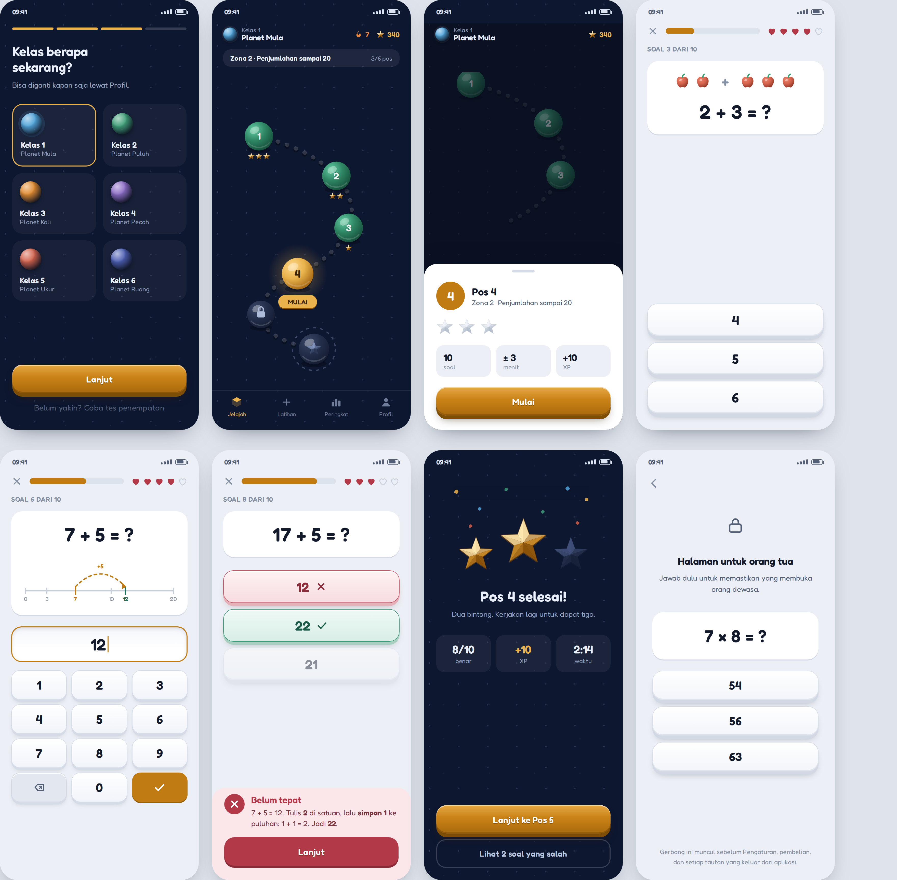
</p>

| | | | |
|:--:|:--:|:--:|:--:|
| 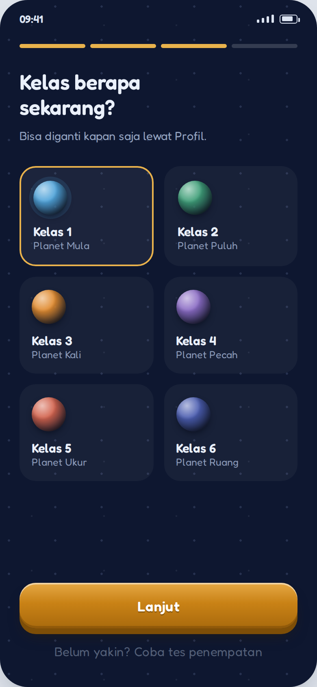 | 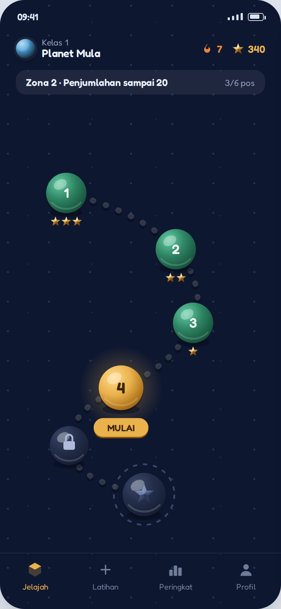 | 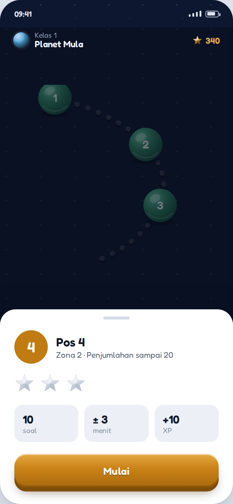 | 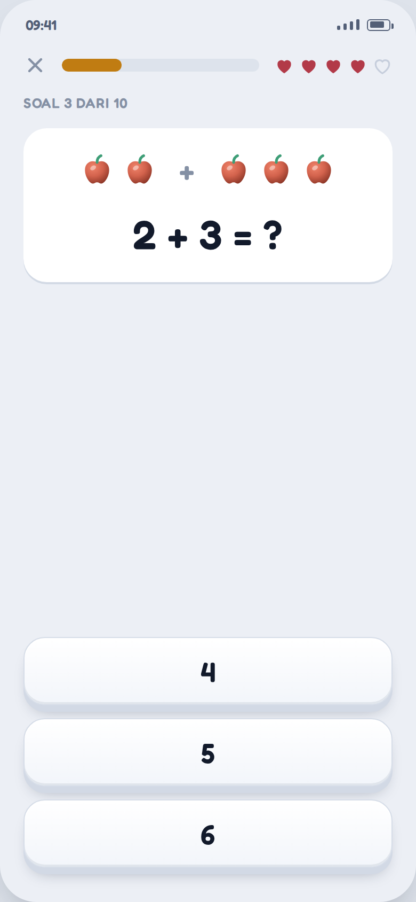 |
| **01 · Pilih planet**<br>Kelas dipilih sendiri sejak onboarding, bukan dikunci berurutan. | **02 · Peta lintasan**<br>Layar utama: pos selesai berbintang, pos aktif menyala, sisanya digembok tapi tetap terlihat. | **03 · Detail pos**<br>Berapa soal, berapa lama, berapa XP — disebutkan sebelum anak masuk. | **04 · Pilihan ganda**<br>Sumbu **S3** paling mudah: benda nyata dulu. Pengecoh 4 dan 6 dari kesalahan hitung jari. |
| 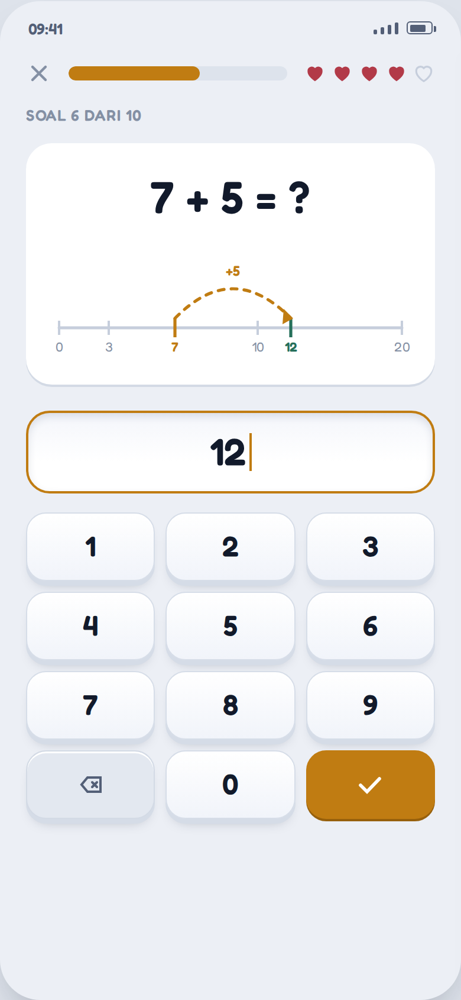 | 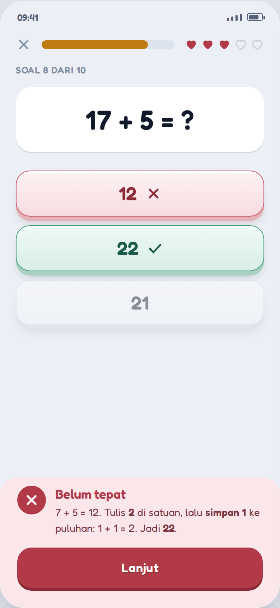 | 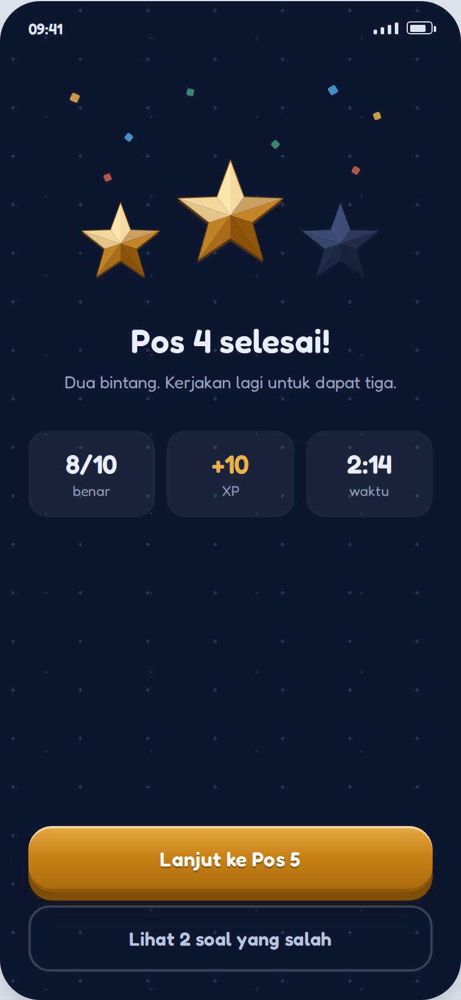 | 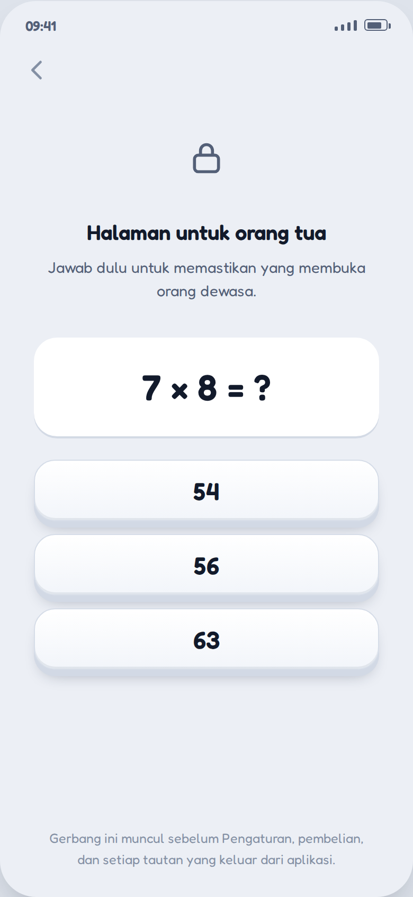 |
| **05 · Isian + garis bilangan**<br>Dua pos lebih jauh: bantuan berubah, jawaban diketik bukan dipilih. | **06 · Jawaban salah**<br>Pembahasannya muncul saat itu juga, dan soalnya masuk mode Perbaiki Kesalahan. | **07 · Hasil pos**<br>Bintang dari akurasi, bukan kecepatan. Tombol kedua langsung ke pembahasan. | **08 · Gerbang Orang Tua**<br>Syarat kategori Kids dan Families Policy. Dipasang sejak sekarang, bukan ditambal nanti. |

Delapan layar ini menutup seluruh alur Tahap 1: dari anak pertama kali membuka aplikasi sampai satu pos selesai dikerjakan dan bintangnya dihitung. Empat sumbu kesulitan sudah terlihat bekerja di antara layar 04 dan 05 — **S3** bantuan visual berubah dari benda ke garis bilangan, **S2** bentuk soal berubah dari memilih ke mengetik, **S1** angkanya naik dari bawah 10 ke bawah 20, dan **S5** posisi yang dicari mulai bergeser.

Sumber rancangannya ada di [`design/ui.html`](design/ui.html) — buka langsung di browser, atau render ulang jadi PNG dengan `python design/shoot.py`. Berkas itu menyematkan fontnya sendiri sebagai base64, jadi tampilannya sama persis di mesin mana pun tanpa perlu memasang Fredoka dan tanpa perlu jaringan.

> **Kedalamannya bukan gambar.** Tiga efek yang membuat layar ini terasa timbul semuanya bisa dibangun langsung di Flutter tanpa satu pun aset raster. **Tombol** memakai `LinearGradient` plus dua `BoxShadow` — satu tanpa blur sebagai tebal badan tombol, satu ber-blur sebagai bayangan jatuh — dan menekannya cukup memangkas offset bayangan pertama dari 7 ke 2 piksel, sehingga tombolnya benar-benar terasa turun. **Bola pos** dan **planet** memakai `RadialGradient` dengan titik cahaya digeser ke kiri-atas, ditambah elips gelap tipis di bawahnya sebagai bayangan. Hanya **bintang** yang jadi aset: SVG bersegi sepuluh sisi dengan tiap sisi diberi terang berbeda sesuai arah cahaya, dirender lewat `flutter_svg`. Geometrinya dihasilkan oleh [`design/make3d.py`](design/make3d.py), jadi kalau palet emasnya berubah, bintangnya tinggal dibangkitkan ulang.


Target akhir tahap ini: **78 pos di dua planet, jalan penuh tanpa jaringan** — dan langsung dirilis ke Play Store. Tidak ada satu pun baris kode Firebase di tahap ini, dan itu disengaja: rilis lebih awal berarti tahu lebih awal apakah orang mau memakainya.

### Tahap 2 · Retensi — **selesai**
- [x] Streak dan pelindung streak mingguan
- [x] Lencana dan layar koleksinya
- [x] Mode Perbaiki Kesalahan dari `question_attempts`
- [x] Tantangan Harian dan Kilat 60 Detik
- [x] Pemberitahuan lokal harian
- [x] Efek suara dan animasi lepas landas

<p align="center">
  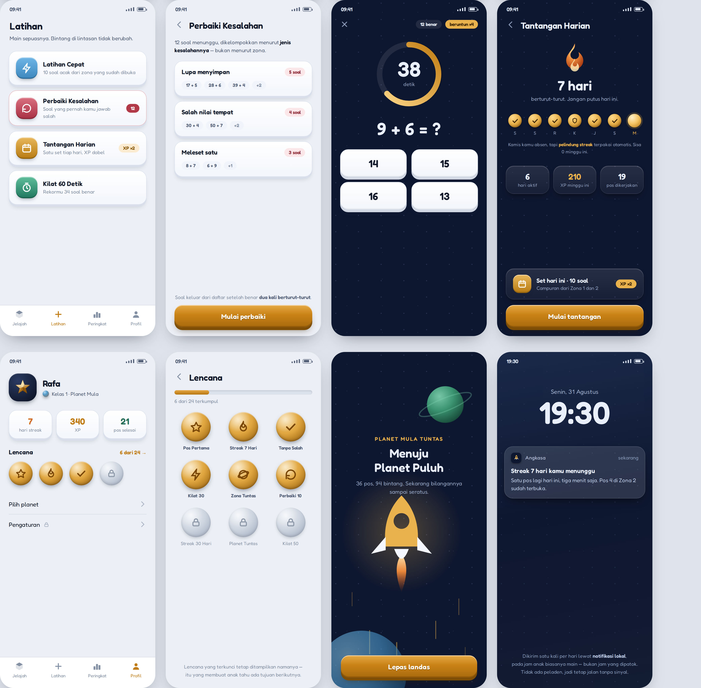
</p>

| | | | |
|:--:|:--:|:--:|:--:|
| 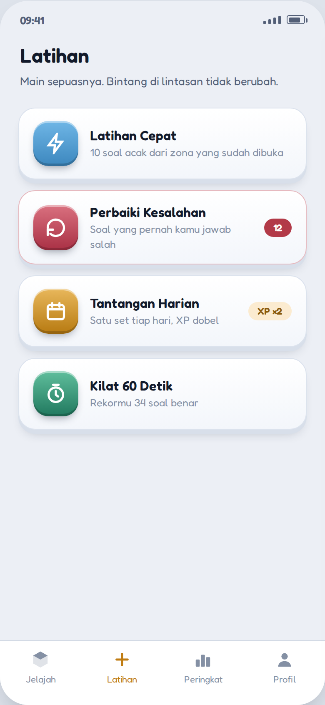 | 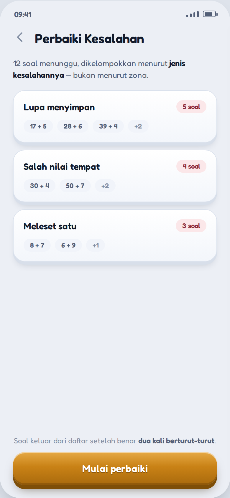 | 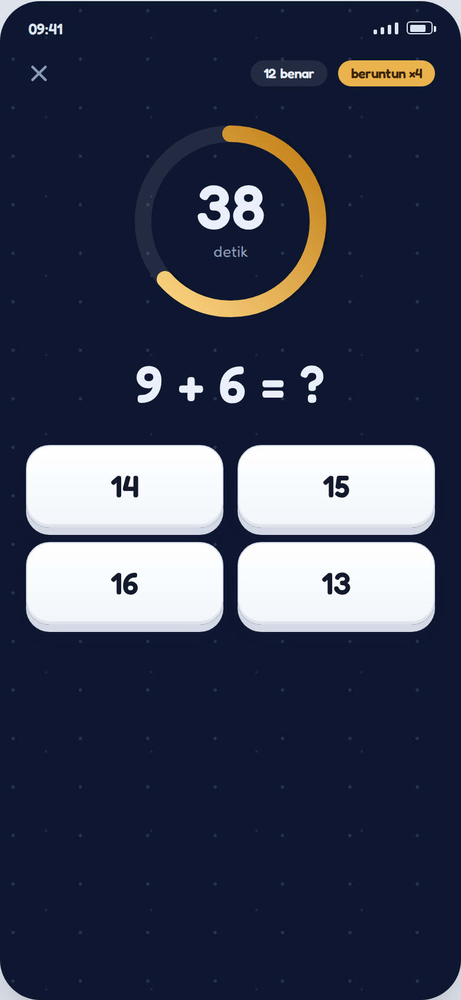 | 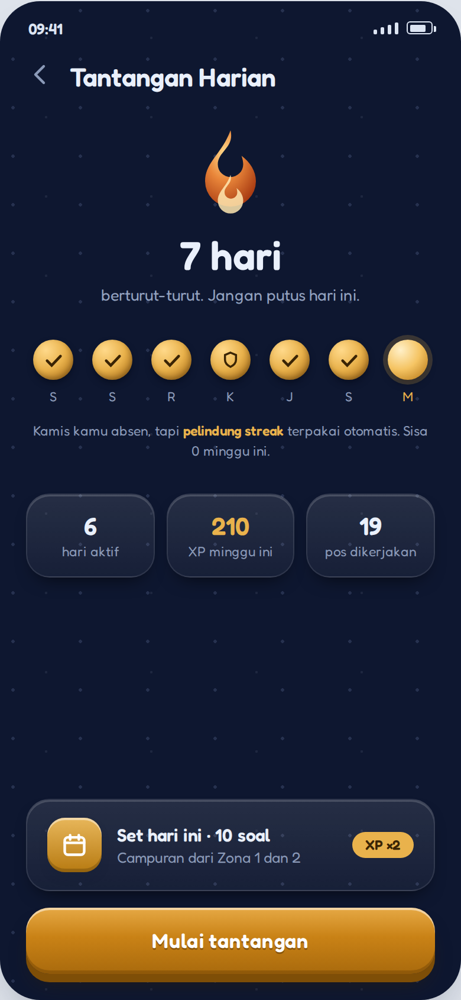 |
| **09 · Latihan**<br>Empat mode bebas. Angka merah di Perbaiki Kesalahan satu-satunya lencana notifikasi di aplikasi ini. | **10 · Perbaiki Kesalahan**<br>Dikelompokkan menurut **jenis kesalahan**, bukan menurut zona. | **11 · Kilat 60 Detik**<br>Pilihan dua kolom supaya jempol tidak berpindah jauh; cincin waktunya ikut memendek. | **12 · Tantangan Harian**<br>Pelindung streak dipakai diam-diam lalu diberitahukan setelahnya. |
| 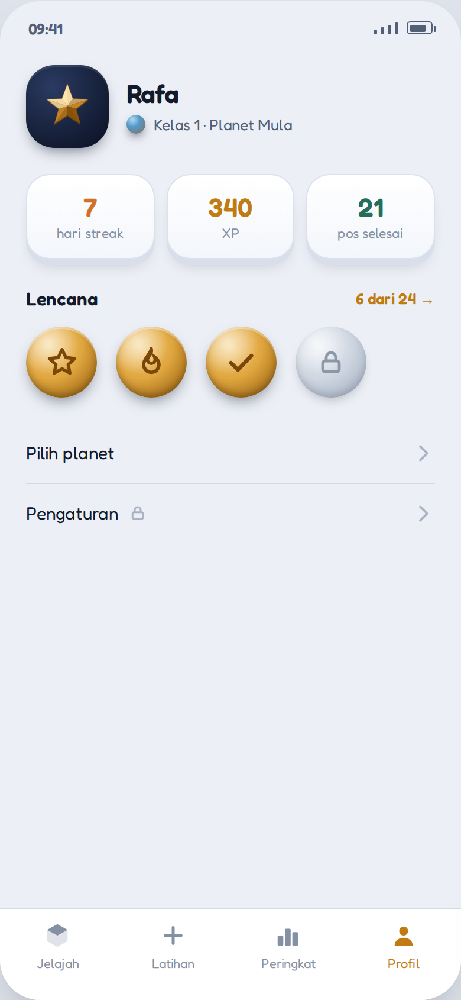 | 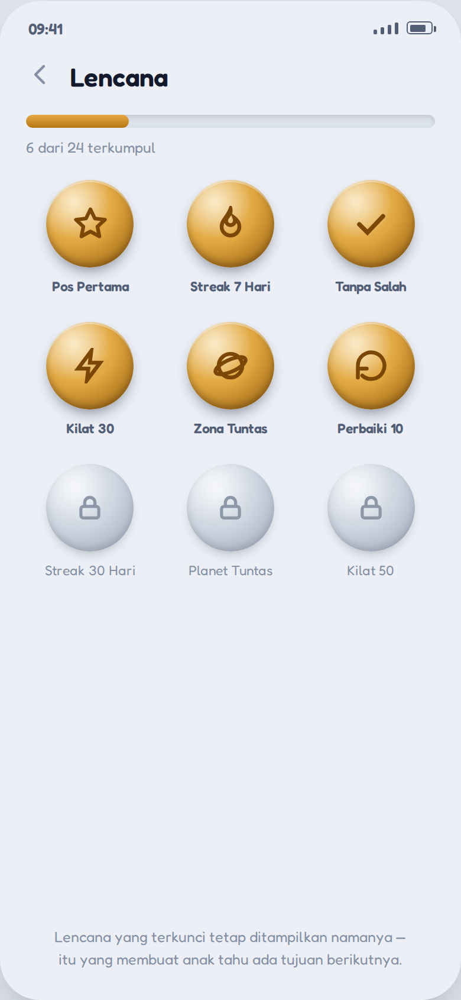 | 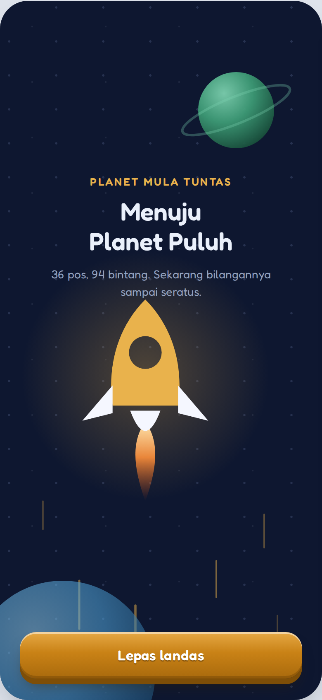 | 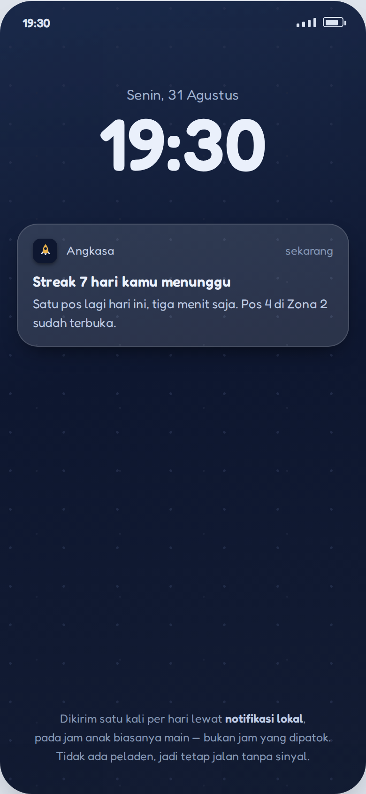 |
| **13 · Profil**<br>Gembok kecil di baris Pengaturan menandakan Gerbang Orang Tua ada di baliknya. | **14 · Lencana**<br>Yang terkunci tetap ditampilkan namanya — itu yang memberi tahu ada tujuan berikutnya. | **15 · Lepas landas**<br>Satu-satunya animasi panjang di aplikasi, dan cuma muncul enam kali seumur pemakaian. | **16 · Pemberitahuan**<br>Menyebut angka streak yang nyata, bukan ajakan umum. Jamnya dipelajari dari `daily_activity`. |

Kalau Tahap 1 menjawab *"anak bisa belajar di sini"*, Tahap 2 menjawab *"anak mau balik lagi besok"*. Semua yang ada di delapan layar ini berjalan di atas data yang sudah dikumpulkan Tahap 1 — tidak ada tabel baru sama sekali. **Perbaiki Kesalahan** membaca `question_attempts`, **Tantangan Harian** dan **streak** membaca `daily_activity`, **Lencana** membaca `level_progress`. Yang bertambah cuma `badges`, dan isinya sekadar kode lencana beserta tanggalnya.

Layar **10** yang paling layak dikerjakan lebih dulu di antara delapan ini. Bukan karena paling sulit, tapi karena dia satu-satunya yang tidak dimiliki kompetitor mana pun — dan biayanya paling murah, karena datanya sudah ada sejak soal pertama dijawab.


Untuk aplikasi anak, suara dan animasi bukan pemolesan akhir — itu fitur inti. Aplikasi anak yang diam terasa rusak, sekalipun semua logikanya benar.

> **Yang dikerjakan di luar delapan layar itu.** Tiga keputusan kecil menentukan bentuk Tahap 2 lebih dari layarnya sendiri. **Pertama, soal tidak disimpan.** Mode Perbaiki Kesalahan merakit ulang soalnya dari `question_signature` — `17+5=?` jadi soal lengkap beserta pengecoh bernama dan pembahasannya lewat `QuestionGenerator.dariSignature`, jadi tidak ada satu baris soal pun yang perlu ikut disimpan sejak Tahap 1. **Kedua, lencana tidak punya penghitung.** Kedua puluh empat lencananya dinilai ulang dari nol tiap sesi, dibaca dari `level_progress`, `question_attempts`, dan `daily_activity`; memperbaiki syarat sebuah lencana tidak pernah butuh migrasi. **Ketiga, suaranya dibangkitkan, bukan diunduh** — [`tool/buat_suara.py`](tool/buat_suara.py) menulis enam berkas WAV pendek dari gelombang sinus, jadi tidak ada lisensi pihak ketiga yang perlu diurus dan totalnya di bawah 150 KB.

### Tahap 3 · Daring ringan — **belum mulai**
- [ ] Firebase Auth anonim
- [ ] `sync_queue` dan sinkron ke Firestore
- [ ] Papan peringkat XP mingguan
- [ ] Remote Config untuk ambang bintang dan besaran XP
- [ ] Crashlytics

<p align="center">
  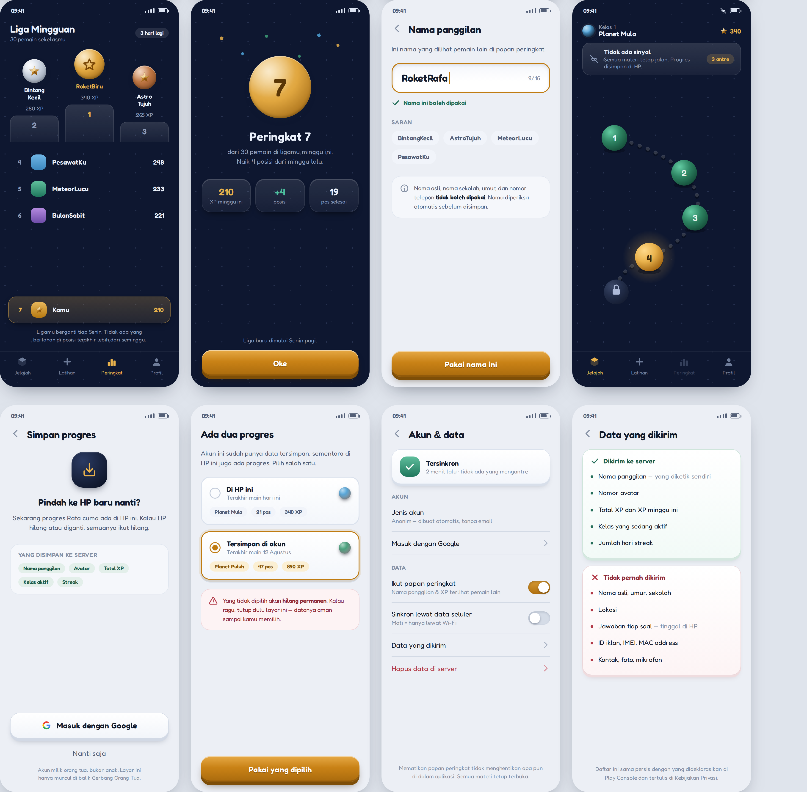
</p>

| | | | |
|:--:|:--:|:--:|:--:|
| 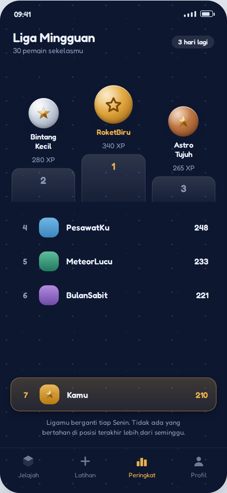 | 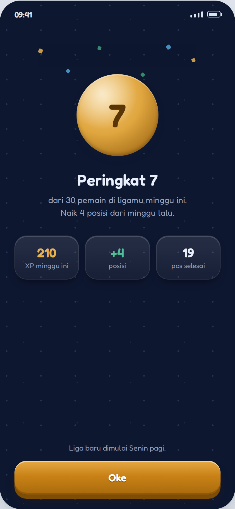 | 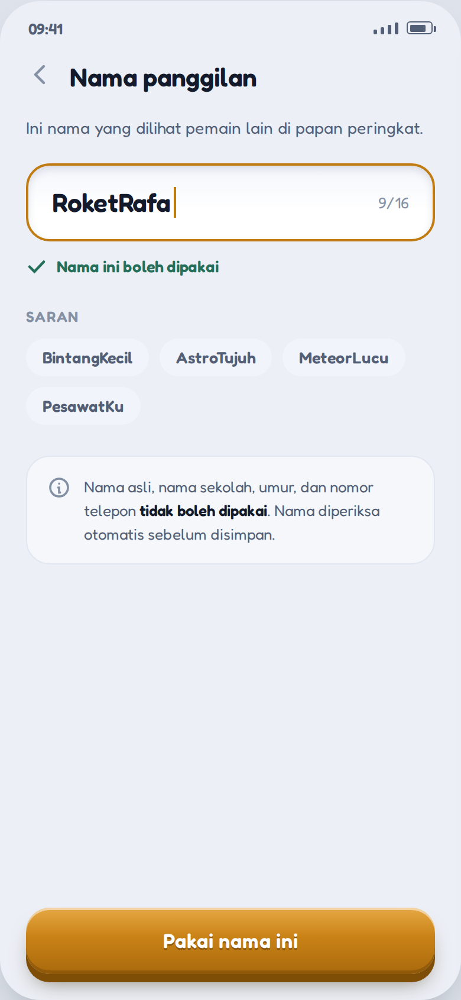 | 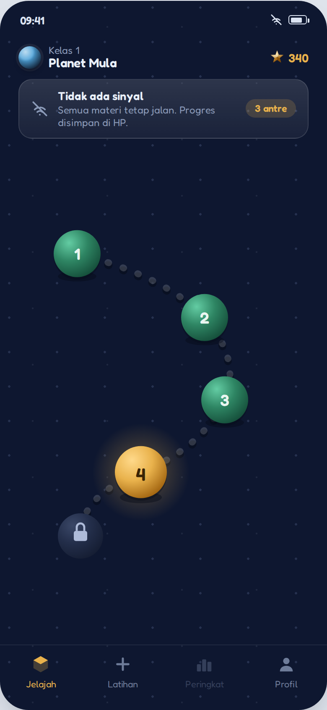 |
| **17 · Liga Mingguan**<br>Bukan peringkat global — 30 pemain per liga, reset tiap Senin. | **18 · Akhir minggu**<br>Yang ditonjolkan pergerakannya, bukan posisinya. | **19 · Nama panggilan**<br>Satu-satunya teks bebas di seluruh aplikasi, jadi satu-satunya yang perlu disaring. | **20 · Luring**<br>Hanya tab Peringkat yang meredup; tiga pos menunggu di `sync_queue`. |
| 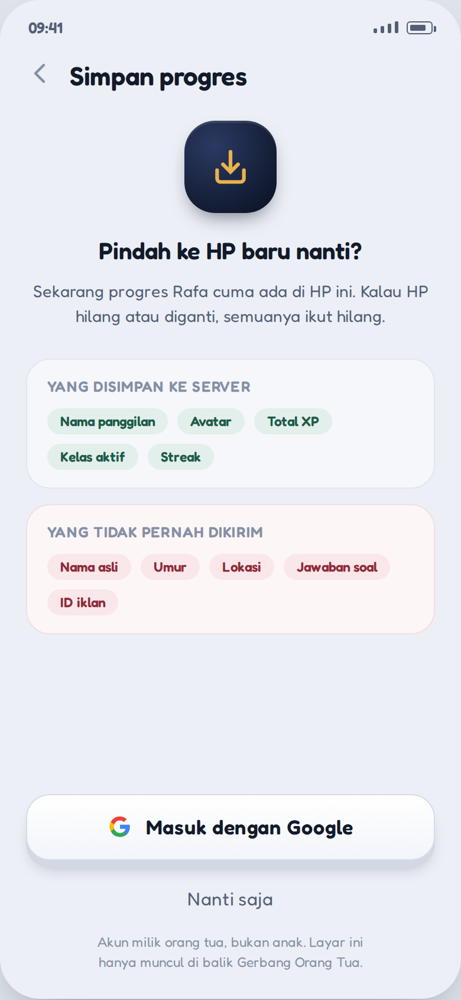 | 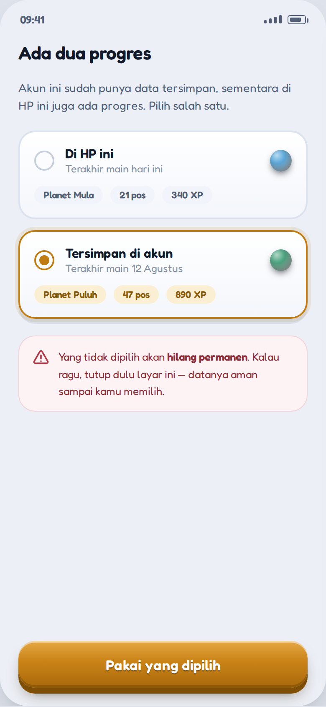 | 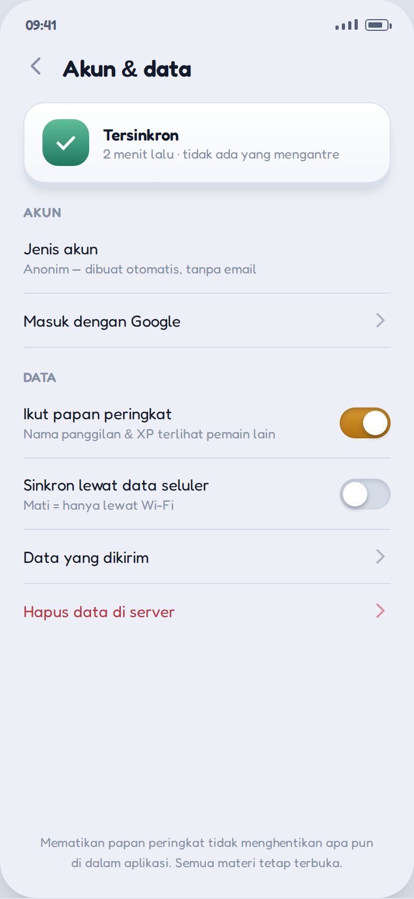 | 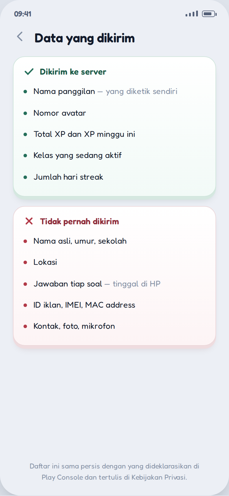 |
| **21 · Simpan progres**<br>Login opsional, di balik Gerbang Orang Tua, tidak pernah menghalangi belajar. | **22 · Pulihkan progres**<br>Satu-satunya tempat data bisa hilang — jadi tidak ada pilihan yang dicentang duluan. | **23 · Akun & data**<br>Papan peringkat bisa dimatikan tanpa mengurangi satu fitur belajar pun. | **24 · Data yang dikirim**<br>Dua daftar yang bisa dibaca orang tua dalam sepuluh detik. |

Tahap ini paling sedikit UI-nya — sebagian besar isinya sinkron, antrean, dan penanganan konflik yang tidak punya layar sama sekali. Dari delapan di atas, **hanya dua yang benar-benar fitur baru** (17 dan 18). Sisanya ada karena begitu aplikasi mulai mengirim data anak keluar dari perangkat, tiga hal jadi wajib: nama yang bisa disaring, tempat orang tua mematikannya, dan daftar yang menyebutkan persis apa yang dikirim.

Tiga keputusan yang menentukan bentuk layar-layar ini:

- **Liga 30 pemain, bukan peringkat global.** Peringkat global berarti ada anak yang jadi nomor 40.000 dan tidak pernah bergerak. Dengan liga kecil yang direset tiap Senin, semua orang punya peluang naik minggu depan — dan `leaderboard_weekly/{weekId}` di skema Firestore memang sudah dirancang untuk ini.
- **Papan peringkat adalah fitur yang bisa dimatikan.** Kalau mematikannya ikut mengunci materi, orang tua akan merasa disandera. Karena itu tombolnya di layar 23 tidak menyentuh apa pun selain apa yang dikirim.
- **Layar 24 bukan halaman hukum.** Isinya harus sama persis dengan deklarasi *Data safety* di Play Console. Kalau nanti ada satu field baru yang disinkronkan, layar ini yang harus ikut berubah — dan itu pengingat murah supaya deklarasinya tidak pernah basi.


Semua yang di atas bersifat tambahan. Kalau Firebase mati, aplikasinya harus tetap jalan persis seperti Tahap 2 — itu syarat yang tidak bisa ditawar untuk aplikasi yang dipakai anak di rumah tanpa sinyal.

### Tahap 4 · Skala dan monetisasi — **belum mulai**
- [ ] Planet Kali, Pecah, Ukur, dan Ruang (kelas 3–6)
- [ ] Soal cerita, geometri, dan statistik dari konten statis
- [ ] Dashboard orang tua: jenis kesalahan, bukan cuma nilai
- [ ] `in_app_purchase` — buka empat planet sekali bayar
- [ ] Rilis iOS

<p align="center">
  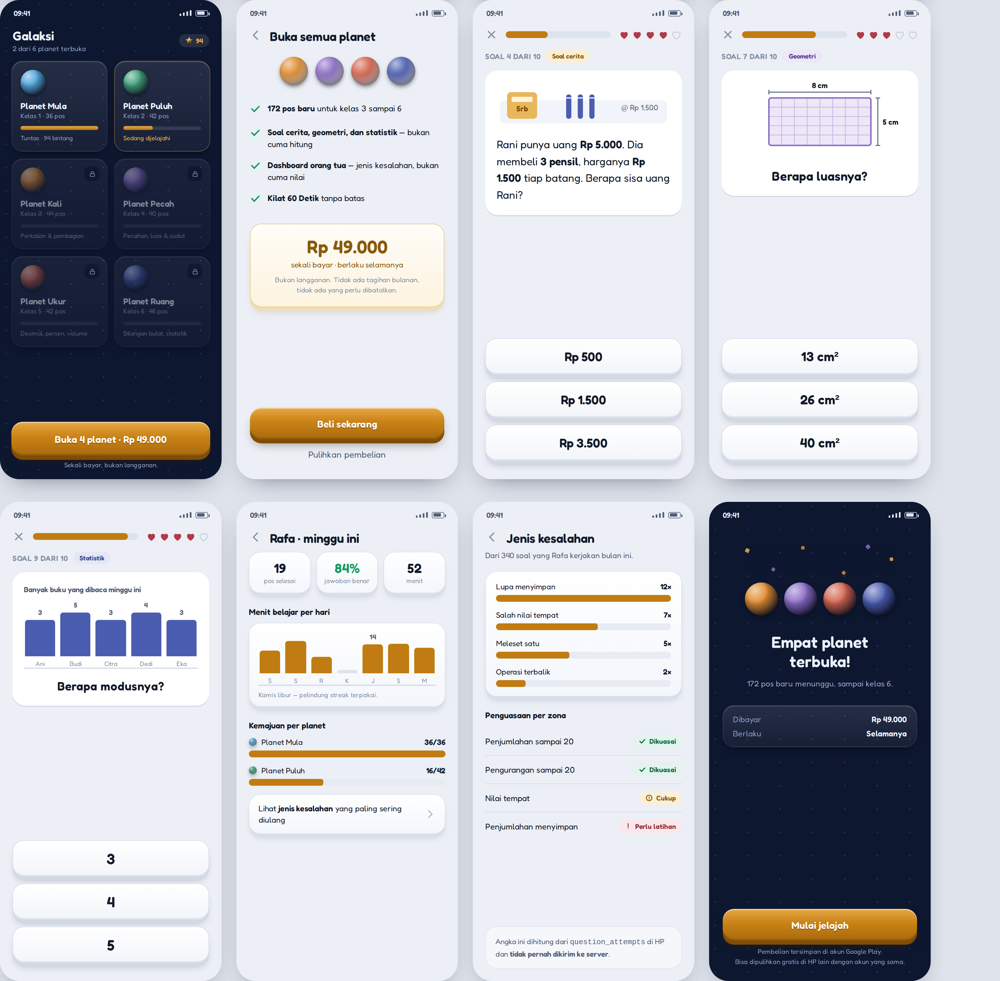
</p>

| | | | |
|:--:|:--:|:--:|:--:|
| 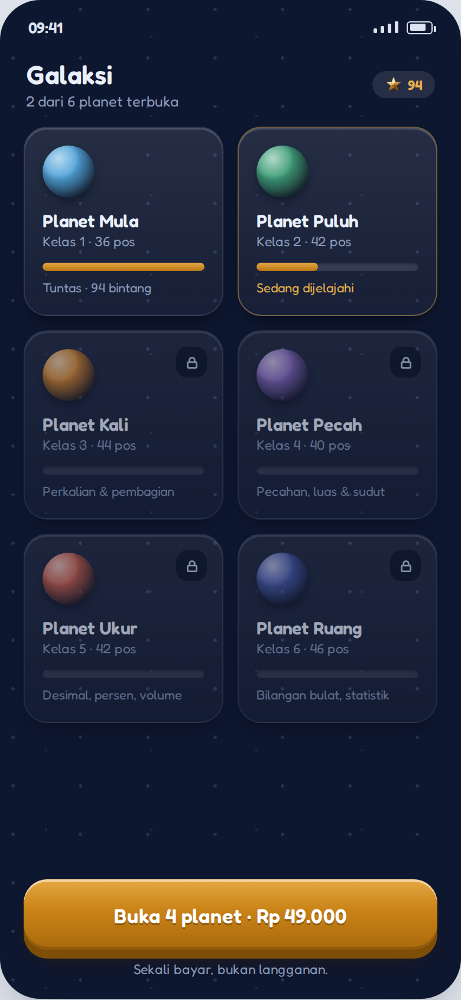 | 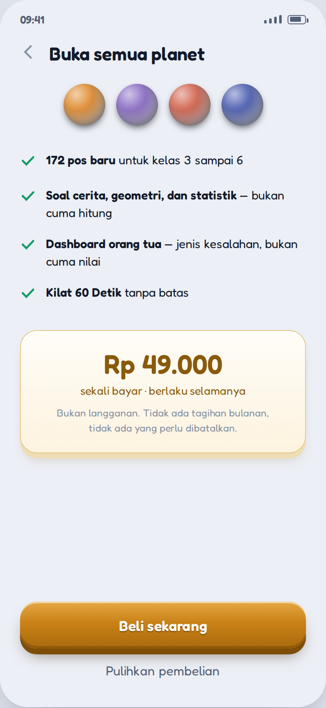 | 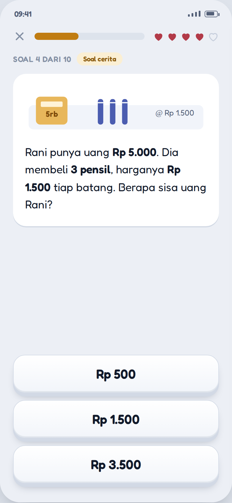 | 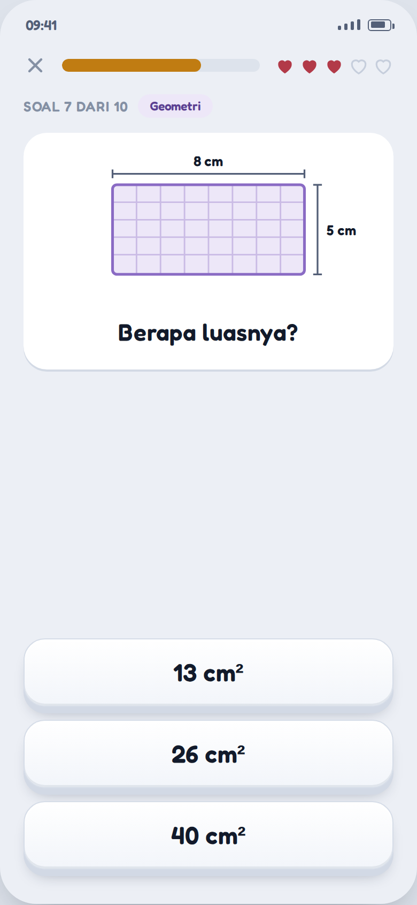 |
| **25 · Galaksi**<br>Planet terkunci tetap menampilkan materinya — bukan kotak tertutup. | **26 · Paywall**<br>Beli sekali, bukan langganan. Harga dan masa berlakunya disebut lugas. | **27 · Soal cerita**<br>Pengecohnya tetap bernama: Rp 3.500 kalau cuma satu pensil yang dikurangi. | **28 · Geometri**<br>Petak bantu bisa dihitung kalau rumusnya lupa. Pengecoh 13 = dijumlah, 26 = keliling. |
| 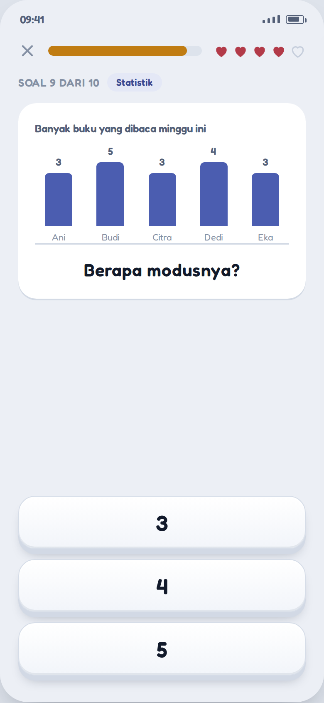 | 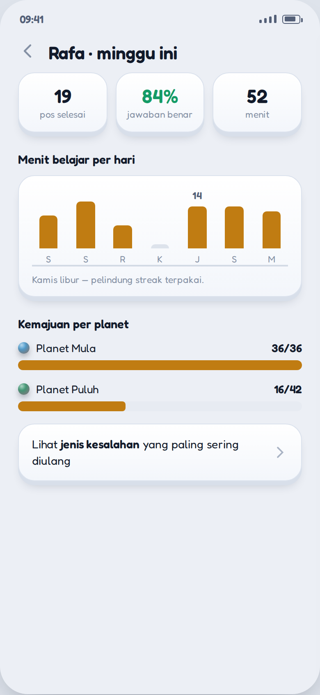 | 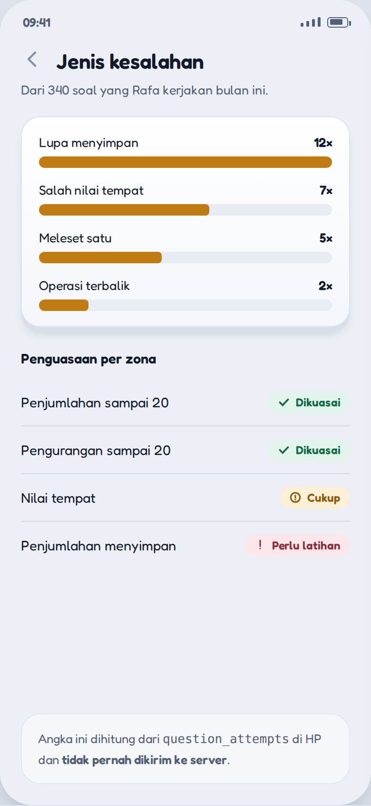 | 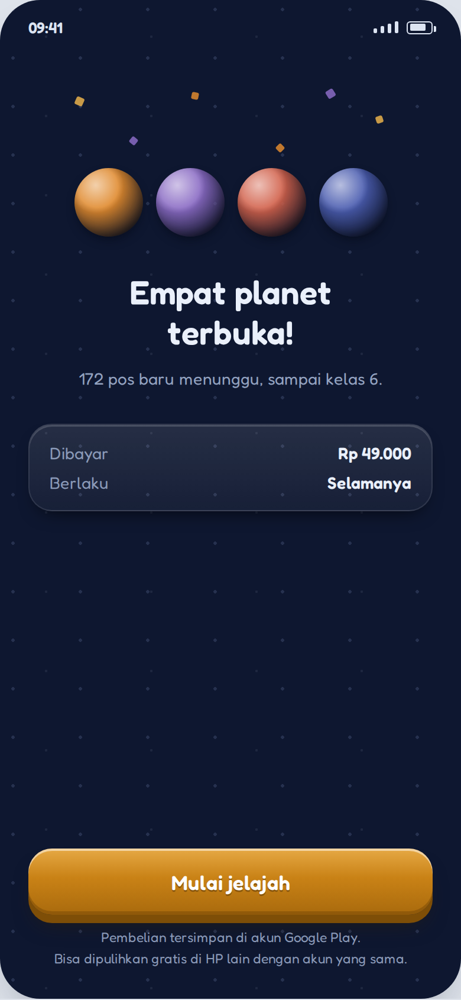 |
| **29 · Statistik**<br>Diagram batang satu warna; nilainya tetap ditulis karena membacanya memang bagian dari soal. | **30 · Dashboard orang tua**<br>Menit belajar apa adanya, tanpa target harian. | **31 · Jenis kesalahan**<br>Panjang batang yang membawa angka; status selalu berpasangan dengan ikon dan tulisan. | **32 · Pembelian berhasil**<br>Cara memulihkan pembelian ditulis di sini, bukan disembunyikan di FAQ. |

Tahap ini melipatgandakan isinya sekaligus membuka permukaan berbayar yang pertama. Empat planet baru menambah **172 pos**, sehingga totalnya pas 250 — angka yang sejak awal dipakai di bagian [Hierarki konten](#hierarki).

Tiga hal yang berubah secara mendasar, bukan sekadar bertambah:

- **Generator soal berhenti mencukupi.** Soal cerita, geometri, dan statistik tidak bisa dibangkitkan dari `DifficultyConfig` — ketiganya butuh konteks, gambar, dan angka yang dipilih tangan. Di sinilah `static_questions` dan berkas JSON di `data/local/database/seed/content/` akhirnya terpakai penuh. Perbandingannya tetap seperti rencana awal: sekitar 80% dibangkitkan, 20% ditulis.
- **`question_attempts` akhirnya membayar dirinya sendiri.** Tabel yang sudah dicatat sejak soal pertama di Tahap 1 baru di sini berubah jadi produk: dashboard orang tua yang menyebut *"lupa menyimpan, 12 kali"* alih-alih *"nilai 84"*. Dan datanya tidak ke mana-mana — perhitungannya di HP, dan layar 31 menyebutkan itu apa adanya.
- **Planet terkunci tetap terbuka isinya.** Orang tua bisa melihat materi kelas 3 sampai 6 sebelum membayar. Menjual kotak tertutup memang menaikkan konversi sesaat, tapi menghasilkan refund dan ulasan bintang satu yang jauh lebih mahal.

> **Aturan diagram di aplikasi ini.** Semua batang memakai **satu warna** — panjangnya yang membawa angka, bukan warnanya. Status penguasaan (Dikuasai / Cukup / Perlu latihan) selalu tampil sebagai ikon + tulisan + warna sekaligus, tidak pernah warna saja, supaya tetap terbaca oleh orang tua yang buta warna. Tiga warna status itu (`#149B66`, `#B5761A`, `#B23A48`) sudah dicek terhadap pemisahan CVD, lantai kroma, dan kontras terhadap permukaan — jangan diganti tanpa mengeceknya ulang.


**Batas yang perlu diketahui.** Apple Developer Program berbiaya $99 per tahun dan review kategori Kids lebih ketat daripada Android. Menunda iOS ke tahap terakhir bukan soal teknis — kodenya toh sudah lintas platform sejak baris pertama — melainkan supaya biaya itu keluar setelah ada bukti orang memakainya.

---

## Catatan Rilis untuk Aplikasi Anak

Bagian yang paling sering dilewat dan paling mahal akibatnya. Kesalahan di sini bisa membekukan akun developer, bukan cuma menolak satu aplikasi.

### Google Play Families Policy

- [ ] Isi deklarasi **Target Audience & Content** di Play Console **sebelum** publish
- [ ] Jangan kirim advertising ID (AAID), IMEI, IMSI, MAC address, nomor seri perangkat, atau data lokasi dari pengguna anak
- [ ] Kalau suatu hari memasang iklan, wajib memakai SDK dari daftar *Google Play Families Self-Certified Ads SDKs*; iklan berbasis minat dan remarketing dilarang
- [ ] Kalau audiensnya campuran anak dan dewasa, sediakan **neutral age screen**
- [ ] Bedakan dengan jelas koin virtual dan uang asli di layar pembelian, tanpa tekanan emosional
- [ ] Sediakan Kebijakan Privasi dan patuhi COPPA serta GDPR

Konsekuensi teknisnya satu baris di `AndroidManifest.xml`:

```xml
<meta-data
    android:name="google_analytics_adid_collection_enabled"
    android:value="false" />
```

Crashlytics aman apa adanya; Analytics yang perlu disetel.

### App Store — kategori Kids

- [ ] Parental gate wajib sebelum tautan keluar aplikasi dan sebelum pembelian
- [ ] Tanpa analytics atau iklan pihak ketiga tanpa parental gate
- [ ] Ikon 1024 × 1024 tanpa alpha dan tanpa sudut membulat

Gerbang Orang Tua sudah masuk daftar layar sejak Tahap 1 justru karena ini. Menambahkannya belakangan berarti membongkar navigasi yang sudah jadi.

---

## Kenapa Namanya Angkasa

Dipilih dari sepuluh kandidat setelah menyaring dua hal.

**Pertama, artinya.** *Angkasa* sudah memuat kata **angka** di dalamnya — tinggal dua huruf lagi. Kata yang dikenal semua orang Indonesia, tapi dibaca ulang. Sekali dijelaskan, tidak ada yang lupa. Dan temanya langsung memberi nama untuk seluruh sistem level: enam kelas jadi enam planet, bab jadi zona, level jadi pos, ujian jadi Gerbang Planet. Nama yang ikut bekerja, bukan sekadar label.

**Kedua, apa yang dihindari.** Seluruh kategori ini di Play Store Indonesia memakai nama deskriptif yang sama:

`Matematika SD` · `Belajar Angka` · `Game Matematika Anak` · `Permainan Matematika` · `Soal Matematika` · `Belajar Berhitung` · `Game Berhitung Matematika SD`

Tidak satu pun yang bisa diingat setelah ditutup. Memilih nama yang punya karakter adalah cara termurah untuk terlihat berbeda di halaman pencarian — dan judul Play Store masih menyisakan ruang untuk kata kuncinya: `Angkasa: Matematika SD 1-6`, 26 dari 30 karakter yang diizinkan.

**Yang masih harus dikerjakan sebelum nama ini dikunci:**

- [ ] Cek merek dagang kelas 9 (perangkat lunak) dan kelas 41 (pendidikan) lewat PDKI Ditjen KI — *Angkasa* kata umum, jadi daya pembedanya rendah
- [ ] Cek domain `.com`, `.id`, dan `.app`
- [ ] Cek Play Store dan App Store
- [ ] Cek handle Instagram dan TikTok
- [ ] Siapkan cadangan **Angkasa Angka** kalau bentrok — plesetannya tetap utuh, jauh lebih mudah didaftarkan, dan judulnya masih muat: `Angkasa Angka: Matematika SD` (28 karakter)

---

## Lisensi

MIT — lihat berkas [`LICENSE`](LICENSE).

---

<p align="center">
  <br>
  <sub><b>Angkasa</b> — anak tidak berhenti karena soalnya susah, tapi karena naiknya terlalu curam.</sub>
</p>
